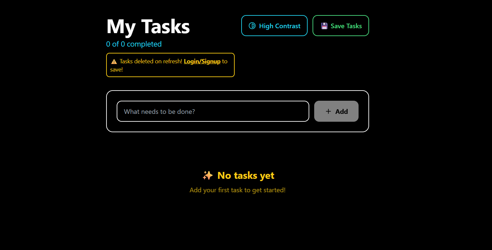
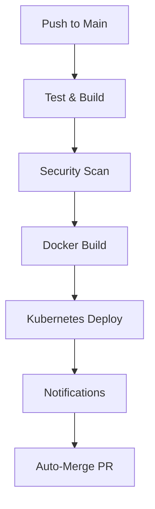

## 🚀 Vue.js Todo App with CI/CD & Kubernetes

A modern, responsive Todo application built with Vue.js 3, featuring a complete CI/CD pipeline, Kubernetes deployment, and cloud-native architecture.



## ✨ Features

### 🎨 Frontend Features
- **Vue.js 3** with Composition API
- **Tailwind CSS** for beautiful, responsive design
- **Dark/Light theme** toggle with smooth transitions
- **Real-time task management** (add, complete, delete)
- **Local storage persistence** for guest users
- **User authentication** with permanent data storage
- **Beautiful gradients** and glass morphism effects
- **Mobile-responsive** design

### 🔐 User Management
- **Guest mode** - Use without account (temporary storage)
- **User accounts** - Permanent task storage
- **Secure authentication** with localStorage
- **Auto-save** functionality
- **Seamless guest-to-user transition**

### 🚀 DevOps & Infrastructure
- **Complete CI/CD pipeline** with GitHub Actions
- **Docker containerization** with multi-stage builds
- **Kubernetes deployment** with Helm charts
- **Auto-scaling** with Horizontal Pod Autoscaler
- **Health checks** and rolling updates
- **Security scanning** with Snyk & Trivy
- **Auto-merge PRs** when all checks pass

## 🏗️ Architecture

```
┌─────────────────┐    ┌──────────────────┐    ┌─────────────────┐
│   Vue.js Frontend│    │   GitHub Actions  │    │   Kubernetes    │
│                 │    │                 │    │                 │
│  • Vue 3        │────│  • CI/CD Pipeline│────│  • Deployment   │
│  • Tailwind CSS │    │  • Security Scan │    │  • Service      │
│  • LocalStorage │    │  • Auto Deploy   │    │  • Ingress      │
│  • PWA Ready    │    │  • Notifications │    │  • HPA          │
└─────────────────┘    └──────────────────┘    └─────────────────┘
         │                        │                        │
         │                        │                        │
         ▼                        ▼                        ▼
┌─────────────────┐    ┌──────────────────┐    ┌─────────────────┐
│   Docker Image   │    │   Container Registry│  │   Cloud Storage  │
│                 │    │                 │    │                 │
│  • Multi-stage  │    │  • GHCR         │    │  • Persistent   │
│  • Optimized    │    │  • Docker Hub   │    │    Volumes      │
│  • Security     │    │  • Private Reg  │    │  • ConfigMaps   │
└─────────────────┘    └──────────────────┘    └─────────────────┘
```

## 🚀 Quick Start

### Prerequisites
- Node.js 18+
- Docker & Docker Compose
- Kubernetes cluster (Minikube, Kind, or cloud)
- kubectl configured

### Local Development

1. **Clone the repository**
```bash
git clone https://github.com/your-username/vue-todo-app.git
cd vue-todo-app
```

2. **Install dependencies**
```bash
npm install
```

3. **Start development server**
```bash
npm run dev
```

4. **Open in browser**
```
http://localhost:5173
```

### Docker Development

```bash
# Build and run with Docker
docker-compose up todo-app-dev -d

# Access at http://localhost:5173
```

## 📦 Deployment

### Kubernetes Deployment

1. **Apply Kubernetes manifests**
```bash
kubectl apply -f k8s/
```

2. **Check deployment status**
```bash
kubectl get all -n todo-app
```

3. **Access the application**
```bash
# If using Minikube
minikube service todo-app-service -n todo-app

# With ingress
echo "$(minikube ip) todo-app.local" | sudo tee -a /etc/hosts
open http://todo-app.local
```

### Docker Deployment

```bash
# Build image
docker build -t vue-todo-app .

# Run container
docker run -d -p 3000:80 --name todo-app vue-todo-app

# Access at http://localhost:3000
```

## 🔧 Configuration

### Environment Variables

Create a `.env` file:
```env
VITE_APP_TITLE=My Todo App
VITE_APP_VERSION=1.0.0
VITE_APP_ENV=development
```

### Kubernetes Configuration

Key configuration files:
- `k8s/namespace.yaml` - Namespace isolation
- `k8s/deployment.yaml` - App deployment
- `k8s/service.yaml` - Service discovery
- `k8s/ingress.yaml` - External access
- `k8s/hpa.yaml` - Auto-scaling

## 🔄 CI/CD Pipeline

### Workflow Overview



### GitHub Actions Workflows

| Workflow | Trigger | Purpose |
|----------|---------|---------|
| **main-ci-cd.yml** | Push to main | Full production deployment |
| **development.yml** | Push to develop | Development testing |
| **auto-merge.yml** | PR events | Auto-merge approved PRs |
| **security-scan.yml** | All pushes | Vulnerability scanning |

### Manual Deployment

```bash
# Manual deployment via GitHub Actions
gh workflow run manual-deploy.yml -f environment=production -f version=v1.2.3
```

## 🛠️ Development

### Project Structure
```
vue-todo-app/
├── src/
│   ├── components/
│   │   └── TodoList.vue      # Main todo component
│   ├── styles/
│   │   └── tailwind.css      # Tailwind imports
│   ├── App.vue              # Root component
│   └── main.js              # App entry point
├── k8s/                     # Kubernetes manifests
├── .github/workflows/       # CI/CD pipelines
├── Dockerfile              # Production container
├── docker-compose.yml      # Local development
└── package.json            # Dependencies & scripts
```

### Available Scripts

```bash
# Development
npm run dev          # Start development server
npm run build        # Build for production
npm run preview      # Preview production build

# Testing
npm run test         # Run unit tests
npm run test:ui      # Run tests with UI
npm run lint         # ESLint code checking
npm run type-check   # TypeScript type checking

# Docker
npm run docker:build # Build Docker image
npm run docker:run   # Run Docker container
npm run docker:dev   # Development with Docker

# Deployment
npm run deploy       # Deploy to Kubernetes
```

### Adding New Features

1. **Create feature branch**
```bash
git checkout -b feature/amazing-feature
```

2. **Make your changes**
3. **Test locally**
```bash
npm run test
npm run lint
```

4. **Commit using conventional commits**
```bash
git commit -m "feat: add amazing new feature"
```

5. **Push and create PR**
```bash
git push origin feature/amazing-feature
```

## 🔒 Security Features

- **Snyk vulnerability scanning** in CI/CD
- **Trivy container scanning** for Docker images
- **Dependency updates** with security patches
- **Secret management** with GitHub Secrets
- **Kubernetes security contexts**
- **Regular security audits**

## 📊 Monitoring & Logs

### Kubernetes Logs
```bash
# View application logs
kubectl logs -f deployment/todo-app -n todo-app

# View all resources
kubectl get all -n todo-app

# Check pod status
kubectl get pods -n todo-app -w
```

### Performance Monitoring
```bash
# Resource usage
kubectl top pods -n todo-app

# HPA status
kubectl get hpa -n todo-app
```

## 🤝 Contributing

We love your input! Please contribute using the following workflow:

1. Fork the repository
2. Create a feature branch (`git checkout -b feature/AmazingFeature`)
3. Commit your changes (`git commit -m 'feat: Add AmazingFeature'`)
4. Push to the branch (`git push origin feature/AmazingFeature`)
5. Open a Pull Request

### Commit Message Convention
We use [Conventional Commits](https://www.conventionalcommits.org/):
- `feat:` New features
- `fix:` Bug fixes
- `docs:` Documentation
- `style:` Code style changes
- `refactor:` Code refactoring
- `test:` Test-related changes
- `chore:` Maintenance tasks

## 🐛 Troubleshooting

### Common Issues

**Docker build fails:**
```bash
# Clean Docker cache
docker system prune -a

# Rebuild with no cache
docker build --no-cache -t vue-todo-app .
```

**Kubernetes deployment stuck:**
```bash
# Check events
kubectl get events -n todo-app --sort-by=.metadata.creationTimestamp

# Describe pod for details
kubectl describe pod -l app=todo-app -n todo-app

# Check resource limits
kubectl top nodes
```

**CI/CD pipeline failing:**
- Check GitHub Actions logs
- Verify secrets are properly set
- Ensure Kubernetes cluster is accessible
- Check resource quotas in cluster

### Getting Help

1. Check the [GitHub Issues](https://github.com/your-username/vue-todo-app/issues)
2. Create a new issue with detailed description
3. Join our [Discord/Slack channel] for support

## 📈 Performance

### Benchmarks
- **Lighthouse Score**: 95+ (Performance, Accessibility, Best Practices, SEO)
- **First Contentful Paint**: <1.5s
- **Time to Interactive**: <2s
- **Bundle Size**: <500KB gzipped

### Optimization Features
- **Code splitting** with dynamic imports
- **Lazy loading** of components
- **Image optimization** and compression
- **CSS purging** with Tailwind
- **Docker multi-stage builds** for minimal images

## 🔄 Updates & Maintenance

### Regular Maintenance Tasks
- Update dependencies: `npm update`
- Security audit: `npm audit fix`
- Docker base image updates
- Kubernetes manifest reviews

### Versioning
We use [Semantic Versioning](https://semver.org/):
- **MAJOR** version for incompatible API changes
- **MINOR** version for new functionality
- **PATCH** version for bug fixes

## 📄 License

This project is licensed under the MIT License - see the [LICENSE](LICENSE) file for details.

## 🙏 Acknowledgments

- [Vue.js](https://vuejs.org/) team for the amazing framework
- [Tailwind CSS](https://tailwindcss.com/) for the utility-first CSS
- [Lucide](https://lucide.dev/) for beautiful icons
- [Kubernetes](https://kubernetes.io/) community for container orchestration
- [GitHub Actions](https://github.com/features/actions) for CI/CD automation

## 📞 Support

- **Documentation**: [GitHub Wiki](https://github.com/your-username/vue-todo-app/wiki)
- **Issues**: [GitHub Issues](https://github.com/your-username/vue-todo-app/issues)
- **Discussions**: [GitHub Discussions](https://github.com/your-username/vue-todo-app/discussions)
- **Email**: your-email@example.com

---

<div align="center">

**Made with ❤️ and Vue.js**

[](https://vuejs.org/)
[](https://github.com/your-username/vue-todo-app/stargazers)
[](https://github.com/your-username/vue-todo-app/network/members)

</div>

## 🛡️ Tech Stack Badges


---

**Ready to organize your tasks?** 🎯 Start using the Vue Todo App today!